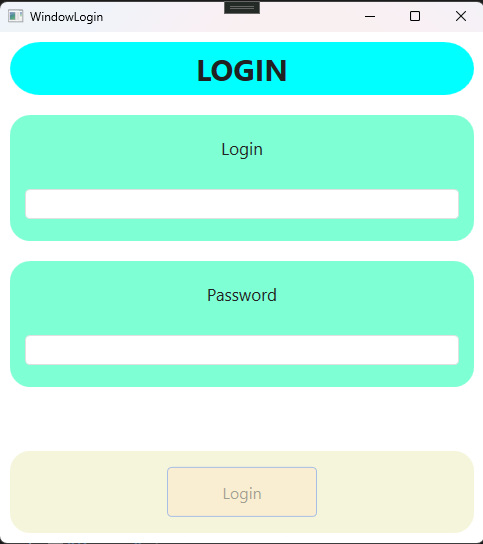
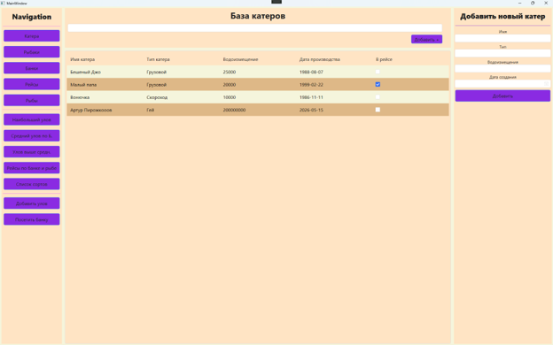

# 🎣 Fish firm service
Fishing company database. The company owns a small fleet of fishing boats. Each boat has a passport indicating its name, type, displacement, and date of build. The company logs each fishing trip, recording the boat name, the names and addresses of crew members with their positions (captain, boatswain, etc.), departure and return dates, and the weight of the caught fish by type (e.g., cod). During a single trip, a boat may visit several banks. The arrival and departure dates for each bank are recorded, as well as the quality of the caught fish (excellent, good, or poor). The catch is not weighed on board.
## 🛠️ Stack
***
- .NET(10)
- WPF
- Entity Framework Core
- MySQL
- LINQ
***
## 📑 List task (which have been implemented)
- For each boat, display departure dates and catches;
- Provide the ability to add a boat departure and crew;
- For the specified date range, display a list of boats with the largest catches for each fish type;
- For the specified date range, display a list of jars, indicating the average catch for that period;
- Provide the ability to add a new jar and provide its details;
- For a given jar, display a list of boats that caught above average catches;
- Display a list of fish types and, for each type, a list of voyages, indicating departure and return dates and catch amounts;
- For the user-selected vouage and jar, add details about the type and amount of fish caught;
- Allow the user to change the characteristics of the selected boat;
- Provide the ability to add a new boat;
- For the specified type of fish and jar, display a list of voyages indicating the quantity of fish caught.
## 📚 What I have learned
- Learned how to create complex database queries using Linq;
- Learned how to work with asynchronous methods and understood the basic operation of this technology (async/await);
- Learned how to create databases from scratch using a task description;
- Learned how to set up a database using Entity Framework Core (the method OnModelCreating);
- Learned the DTO and Repository patterns;
- Repeated work with the MVVM pattern.
## 📂 Installation
1. Clone repositrory to your local machine.
2. If you don't have app "MySQL Workbench" you can load it here: [MySQL Workbench](https://dev.mysql.com/downloads/workbench/) (if you have any DBMS just skip this step).
3. Setting up a connection string:  
   3.1. Open file appsettings.json;  
   3.2. In the quotes (after "DefaultConnection":) write the following string: "Server=localhost;database=yourdbname;pwd=yourpassword;uid=root;port=3306;" (don't forget to enter your data).  
   3.3. If you have another database, than enter connection string for your provider (you can find it in the internet).  
   3.4. And then save file.  
4. Now we now we need to perform migrations:  
   4.1. Open project in powershell or Visual Studio.  
   4.2. Complete the following commands:
   ```bash  
      dotnet tool install --global dotnet-ef  
      dotnet-ef database update
   ```  
   4.3. If previous command finished with an error than try to write: _dotnet add package Microsoft.EntityFrameworkCore.Design_
6. If all the previous steps were completed successfully, now all we have to do is launch our application using the following commands:
   ```bash
      winget install Microsoft.DotNet.SDK.10
      cd fish-firm-service #(or full path to this folder, for example: C:/Users/user123/fish-firm-service)
      dotnet restore
      dotnet build
      dotnet run
   ```
## 🏛️ Application UI
 
<div align="center">
   <h3> Login window </h3>
   
</div>

<p></p>

<div align="center" width="100%">
   <h3> Main menu window </h3>
   
</div>  
